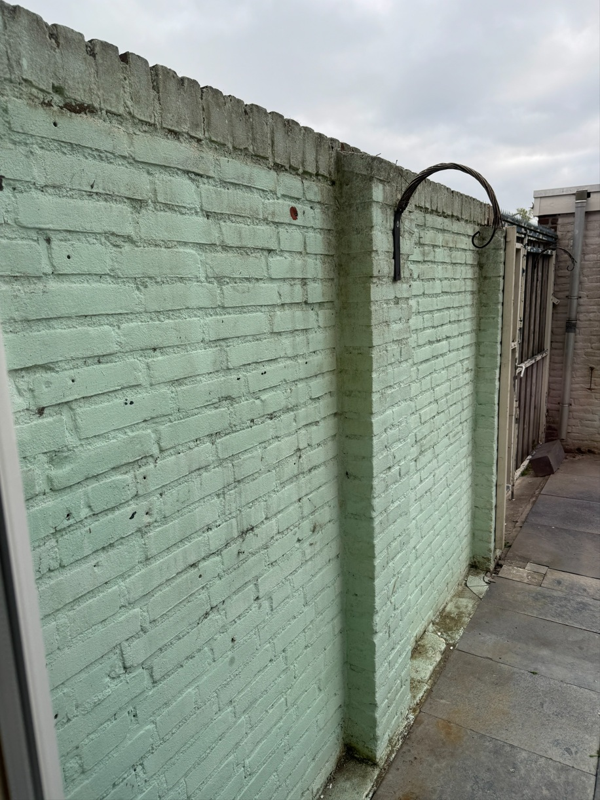
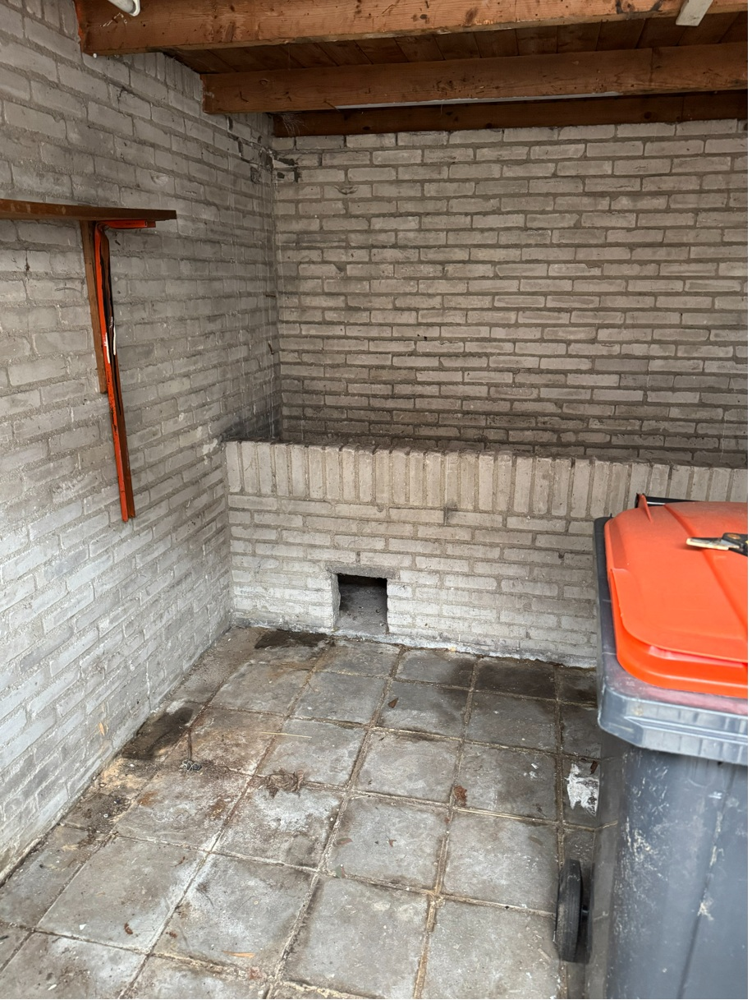

## Kwaliteit

- Terras moet afwaterend zijn zodat er geen water op blijft staan. Deze kwaliteitsnorm heeft betrekking op het terras van BW (zie voorzieningenniveau)
- Er ligt geen afval, spullen, goederen of uitwerpselen in de buitenruimte.
- Schrobput laten vervallen/verwijderen indien het riool vervangen wordt
- Vijvers zijn verwijderd (of overgenomen)
- Ondeugdelijke elektra dient verwijderd te worden
- Grote bomen > 2,5m verwijderen
- De tuin/ het balkon is schoon en in goede staat 
- Denk groen ivm vol betegelde tuinen
- Er zijn geen kuilen dieper dan 22 cm. Glooiingen toegestaan. 
- Tegels zijn stroef en niet overmatig versleten en/of vies. 
- Buitenkranen zijn juist aangebracht en vorst bestendig. Let op! Een buitenkraan kan een ZAV zijn, dan voert BW geen onderhoud uit.
- Buitengevels zijn in originele kleur. Wit gekalkt of graffity behoren niet tot de basiskwaliteit

### Afscheiding

- Aanwezige privacy schotten zijn goed bevestigd, zijn heel (beschadigingen toegestaan, wel veilig) en staan recht.
- Bestaande erfafscheiding ter plaatse van de achteruitgang incl. poort is heel en veilig, anders verwijderen en vervangen voor paal en draad.
- Bestaande erfafscheiding in slechte staat laten staan, alleen in overleg met buren verwijderen en vervangen voor paal en draad. Tenzij BW eigendom is van de erfafscheiding.
- Koplatten op schuttingen zijn intact en functioneren.

### Verharding

- Verhardingen (terras/tegelpad) zijn in tact en niet verzakt.
- Indien de verharding > 25% is beschadigd of niet voldoet aan de richtlijnen, dan verwijderen en geen tegelwerk terugplaatsen m.u.v. minimale voorziening terras en tegelpad.

### Planten, struiken en bomen

- Er is minmaal onkruid aanwezig.
- Het gras is ≤ 10 cm hoog.
- Klimop tegen de gevel(s) is niet toegestaan.
- Hagen, bomen en struiken zijn gesnoeid en geen ongebruikelijke uitgroei hebben die hinder veroorzaakt aan de omgeving.
- Dode beplanting, bomen en takken zijn niet toegestaan.
- Opschietende bomen zijn verwijderd.
- Bomen hebben geen dode takken.
- Bomen die gevaarlijk, zwak of ziek zijn of mogelijk schade of overlast veroorzaken zijn verwijderd. Bomen rooien tot 30cm onder het maaiveld.

### Balkon/galerij

- Uitpandig: vloer schoon, geen mosvorming
- Betontegels (indien van toepassing) op tegeldragers, stabiel en intact
- Transportogen afgewerkt/dichtgezet
- Dilatatievoegen aansluitend en dicht

### Schuur/Berging/Balkonkast

- De berging of balkonkast is heel en functioneel.
- Geen verwarming noodzakelijk.
- Geen isolatie noodzakelijk, mag klam aanvoelen.
- Geen wandafwerking noodzakelijk, wel veilig. Denk hierbij aan afvallende delen, scherpe randen etc.
- Gekleurde stenen niet toegestaan, tenzij door BW aangebracht ( hele straat / wijk )

### Portiek

- Wanden en vloeren schoon
- Inpandig: vloer vlak
- Uitpandig: vloer vlak en antislip
- Trapleuningen/Balustrade vast en intact
- Verlichting conform veiligheidsvoorschriften en bouwbesluit
- Traptreden vlak en <5mm ingesleten
- Droogloopmat (indien aanwezig) vast, functioneel en intact

### Gevel

- Metselwerk waterdicht
- Voegwerk vast en dicht
- Spijker-/boorgaten opgevuld
- 1 Tint en formaatverschil na reparatie of vervanging
- Indien van toepassing: schilderwerk of stucwerk buitengevel egaal en vast
- Beplating (volkern/trespa) intact, volledig vast en gelijkmatig verweerd
- Kleine grindnesten in betonwanden < 10mm
- Vrij van kalk- of cementsluiervorming
- Krimpscheuren < 2 mm
- Raamdorpelstenen intact en vast
- Geveldoorvoer tbv gevelkachel dichtgemetseld met gelijke steen en voeg
- Lateien constructieve oplegging conform constructie zonder doorbuiging
- Latei waterdicht/waterkerend ingelegd (lood/kunststof)
- Zijwangen dakkapel (volkern/trespa/of soortgelijk) vastzittend, vrij van rot
- Rabbatdelen/potdekselwerk (voorzien van vochtkering), geen rot, vast, dicht
- Spouw geventileerd (open stootvoegen)
- Buitengevel vrij van groene aanslag of andere vervuiling

## Richtlijn mutaties

- Erfafscheiding die niet voldoen worden verwijderd en vervangen voor paal en draad.
- Gekleurde wanden ( zoals wit ) niet toegestaan. Tenzij door BW aangebracht.
- Huurder is altijd verantwoordelijk voor het standaard BW achter te laten, ook bij 50 jaar + gehuurd.

## Behouden

  <h2>Behouden</h2>
  

  

  

## Herstellen

  <h2>Herstellen</h2>
  
  
Gekleurde buitenmuur niet toegestaan.

  
  
Onkruid verwijderen en 25� tegels verwijderen.

   
  
Onkruid verwijderen en 25� tegels verwijderen.

   
  
Ophogen en opnieuw bestraten.

   
  
Ophogen en opnieuw bestraten.

   
  
Paal en draad aanbrengen.

  

## Vervangen

  <h2>Vervangen</h2>
  
  
Kolenhok verwijderen.

  
  
Poortverwijderen - paal en draad terug.

  
  
  
  
Verwaarloosd, opknappen.

  
  
Niet meer te herstellen.

