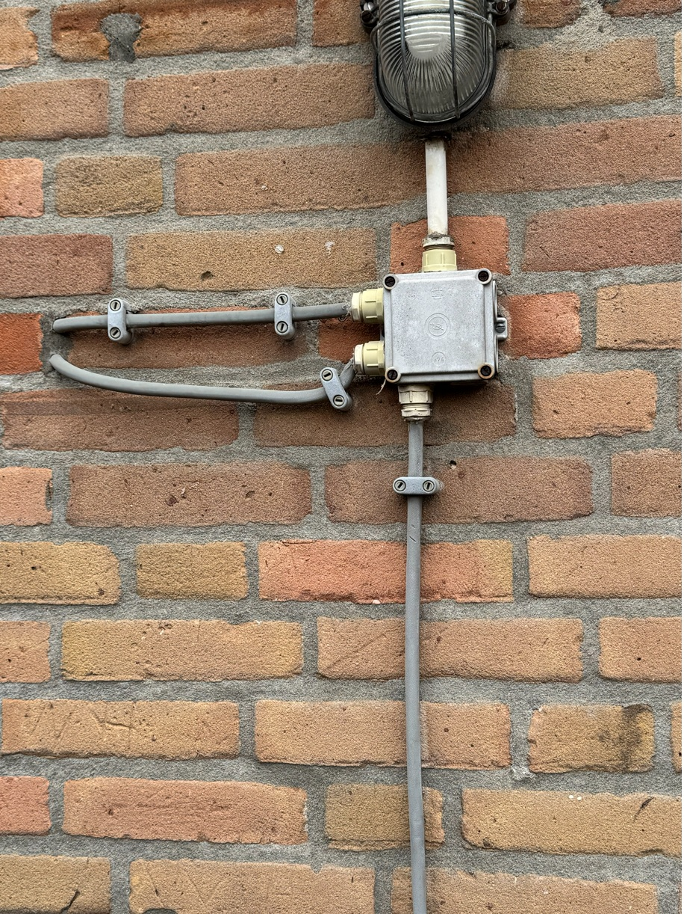
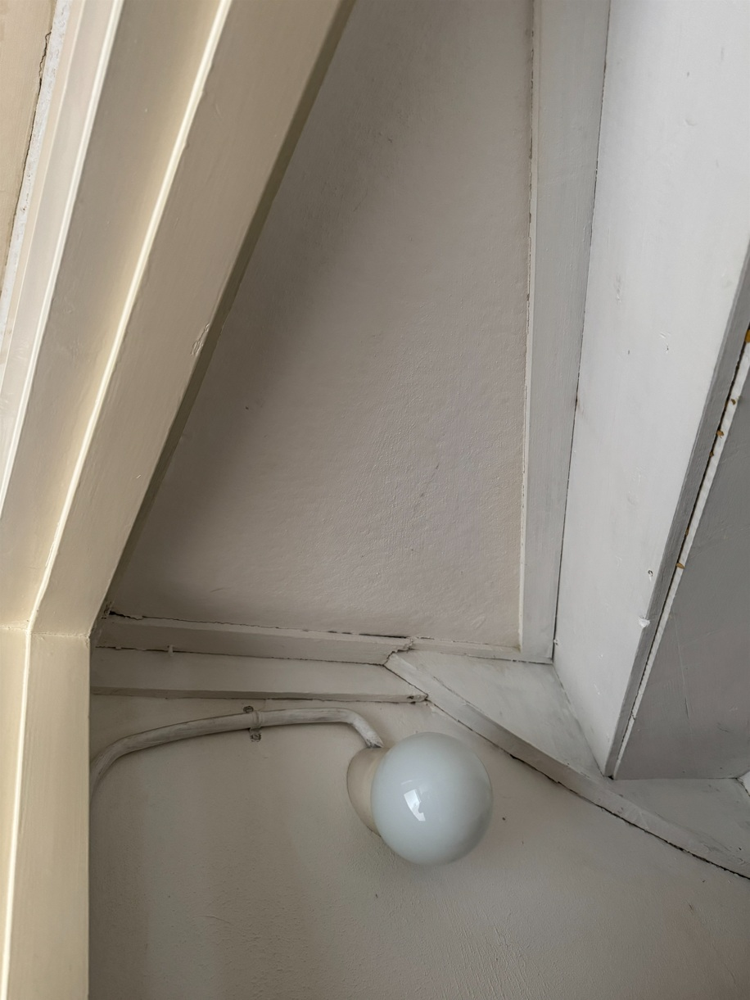

## Kwaliteit

Schakelaars, WCD’s en andere onderdelen uit de elektrische installatie zijn

- Heel
- Volgens de norm aangesloten, dus veilig
- Zitten vast
- Zijn schoon (Vrij van verf, vet en nicotineaanslag)
- Tintverschil in de zelfde ruimte is toegestaan, kleurverschil niet
- schuinzittend schakelmateriaal niet toegestaan

## Richtlijn uitvoering werkzaamheden

- Indien een wand wordt gestuct controleren of het schakelmateriaal nog van voldoende kwaliteit is. Behouden indien in orde, anders vervangen.
- Poreus schakelmateriaal is niet toegestaan indien de wand wordt gestuct.
- Bakeliet schakelmateriaal wordt altijd vervangen.

## Behouden

  <h2>Behouden</h2>
  
  
Kleur geen issue.

## Herstellen

  <h2>Herstellen</h2>
  
  
  
Montage plaat beschilderd.

  
  
  
Montage plaat niet juist aangebracht.

## Vervangen

  <h2>Vervangen</h2>
  
  
  
Niet schoon te krijgen.

  
  
  
  
ZAV elektra weghalen of controleren.

