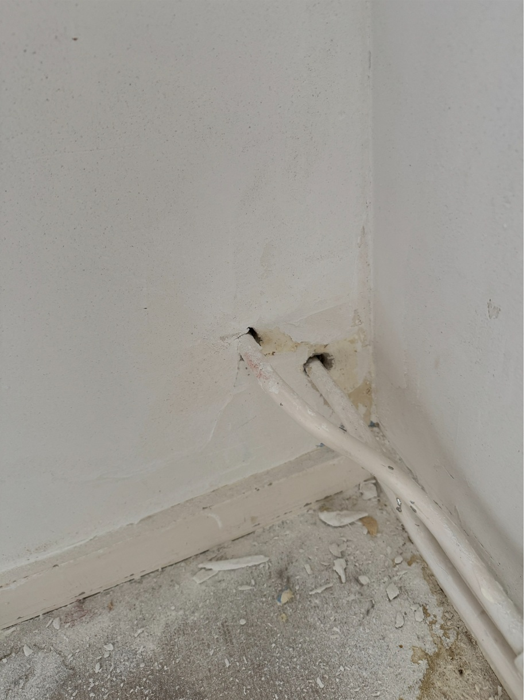
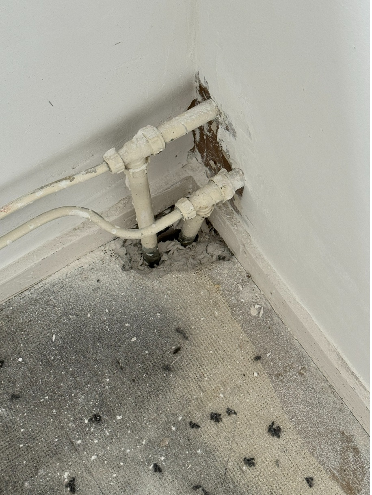

## Kwaliteit

- Watermeter is afleesbaar
- Water afstopkraan functioneert
- Waterleiding is gebeugeld
- Verroest leidingwerk gronden

### Radiatoren

- Geen lekkage
- Afsluiters goed werkend
- Schoon
- Oxidatie aan de rand van de radiator niet toegestaan
- Donkere kleuren radiatoren zijn niet toegestaan
- Schilderen van radiatoren is toegestaan als dit met radiatorlak in lichte kleur wordt uitgevoerd
- Schilderen van leidingen en beugels is toegestaan als dit met radiatorlak in lichte kleur wordt uitgevoerd

### Leidingen

- Leidingen moeten intact zijn (geen lekkage)
- Er mogen geen loze einden zijn bij waterleidingen
- Donkere kleuren leidingen zijn niet toegestaan
- Leidingen zijn dusdanig afgewerkt dat het risico op bevriezing wordt voorkomen.

## Richtlijn Uitvoering werkzaamheden

- Bij gebreken aan de cv ketel moet dit worden doorgegeven aan de contractpartners
- Kleine ingrepen direct uitvoeren ivm doorlooptijd
- Al het leidingwerk is aangebracht volgens de voorschriften
- Bij vervanging wordt de badkamerradiator vervangen voor een gegalvaniseerde versie.
- Bij oxidatie aan de radiator ≤ 5mm wordt dit bijgewerkt met verf. Anders radiator vervangen.

## Behouden

  <h2>Behouden</h2>
  
  
Schoon, heel en veilig.

## Herstellen

  <h2>Herstellen</h2>
  
  
Geen rozetten.

  
  
Niet afgewerkte vloerafwerking.

  
  
Bij meer dan 4 leidingen in het zicht, koof gewenst.

  
  
  
Gekleurde radiatoren en leidingen niet toegestaan.

  
  
Moet worden schoongemaakt.

  
  
Radiator recht hangen.

  
  
Roest minder dan 5mm herstellen.

## Vervangen

  <h2>Vervangen</h2>
  
  
Gaskachel vervangen.

  
  
  
Niet meer te herstellen.

